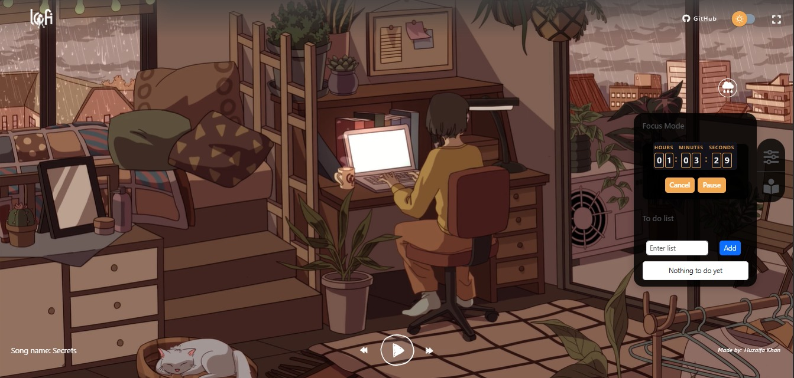
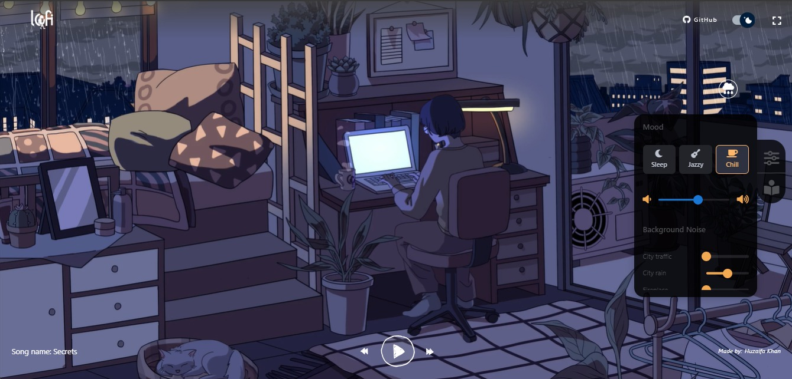

<div align="center">
  
  
  # 🎵 Lofi Music Website
  
  [](https://reactjs.org/)
  [](https://www.typescriptlang.org/)
  [](https://redux.js.org/)
  [](https://mui.com/)
  [](https://opensource.org/licenses/MIT)
  [](http://makeapullrequest.com)
  
  <p align="center">
    <a href="#-features">Features</a> •
    <a href="#-tech-stack">Tech Stack</a> •
    <a href="#-getting-started">Getting Started</a> •
    <a href="#-contributing">Contributing</a> •
    <a href="#-support-us">Support Us</a>
  </p>
   
  A modern, interactive lofi music streaming platform built with React.js and TypeScript. Experience a soothing and relaxing ambiance with our carefully curated lofi music collection. Perfect for studying, working, or just relaxing.
  
  
  
  
</div>

## 🎯 Live Demo

<div align="center">
  <a href="https://your-deployment-url.com">
    
    <br/>
    <strong>Try it out →</strong>
  </a>
</div>

## 🌟 Features 

<div align="center">
  <table>
    <tr>
      <td align="center">
        <h3>🎵 Music Experience</h3>
        <ul align="left">
          <li><b>Dynamic Theme Switching</b> - Seamlessly switch between day and night modes</li>
          <li><b>Rain Effect Toggle</b> - Add ambient rain sounds to enhance your experience</li>
          <li><b>Customizable Timer</b> - Set study/work sessions with our built-in timer</li>
          <li><b>Fullscreen Mode</b> - Immerse yourself in the experience</li>
          <li><b>Background Videos</b> - Dynamic videos that change with the theme</li>
          <li><b>Volume Control</b> - Adjust music and rain effect volumes independently</li>
        </ul>
      </td>
      <td align="center">
        <h3>💻 Technical Features</h3>
        <ul align="left">
          <li><b>Responsive Design</b> - Enjoy on any device</li>
          <li><b>Modern UI/UX</b> - Clean interface with smooth animations</li>
          <li><b>State Management</b> - Efficient handling with Redux Toolkit</li>
          <li><b>Type Safety</b> - Built with TypeScript</li>
          <li><b>Performance</b> - Fast loading and smooth transitions</li>
          <li><b>Cross-browser</b> - Works on all modern browsers</li>
        </ul>
      </td>
    </tr>
  </table>
</div>

## 🛠️ Tech Stack

<div align="center">
  <table>
    <tr>
      <td align="center">
        <h3>Frontend</h3>
        <ul align="left">
          <li>React.js with TypeScript</li>
          <li>Redux Toolkit</li>
          <li>Material-UI & Bootstrap</li>
          <li>SCSS</li>
        </ul>
      </td>
      <td align="center">
        <h3>Tools</h3>
        <ul align="left">
          <li>ESLint</li>
          <li>Prettier</li>
          <li>TypeScript</li>
          <li>Webpack</li>
        </ul>
      </td>
      <td align="center">
        <h3>Audio</h3>
        <ul align="left">
          <li>React Audio Player</li>
          <li>React Player</li>
          <li>Custom Audio Controls</li>
        </ul>
      </td>
    </tr>
  </table>
</div>

## 📦 Dependencies

<details>
<summary>View Dependencies</summary>

### Core Dependencies
```json
{
  "react": "^18.2.0",
  "react-dom": "^18.2.0",
  "typescript": "^5.1.6",
  "@reduxjs/toolkit": "^1.9.5",
  "react-redux": "^8.1.1",
  "react-router-dom": "^6.2.1"
}
```

### UI Dependencies
```json
{
  "@mui/material": "^5.2.7",
  "@emotion/react": "^11.7.1",
  "@emotion/styled": "^11.6.0",
  "bootstrap": "^5.1.3",
  "react-bootstrap": "^2.1.0"
}
```

### Audio Dependencies
```json
{
  "react-audio-player": "^0.17.0",
  "react-player": "^2.9.0"
}
```
</details>

## 🚀 Getting Started

### Prerequisites

<div align="center">
  <table>
    <tr>
      <td align="center">
        <h3>Required</h3>
        <ul align="left">
          <li>Node.js (v14+)</li>
          <li>npm or yarn</li>
          <li>Modern browser</li>
          <li>Git</li>
        </ul>
      </td>
      <td align="center">
        <h3>Recommended</h3>
        <ul align="left">
          <li>VS Code</li>
          <li>React DevTools</li>
          <li>Redux DevTools</li>
          <li>GitHub CLI</li>
        </ul>
      </td>
    </tr>
  </table>
</div>

### Quick Start

```bash
# Clone the repository
git clone https://github.com/HuzaifaKhanDeveloper/lofi-chill-website.git

# Navigate to project directory
cd lofi-chill-website

# Install dependencies
npm install --legacy-peer-deps

# Start development server
npm start
```

Visit `http://localhost:3005` to see the application.

## 📝 Project Structure

```
src/
├── assets/        # Static assets (images, videos)
├── components/    # Reusable UI components
│   ├── ModifierBoard/    # Timer and controls
│   │   ├── index.tsx     # Main component
│   │   ├── styles.scss   # Component styles
│   │   └── types.ts      # Type definitions
│   ├── RainToggleButton/ # Rain effect toggle
│   └── DarkLightSwitch/  # Theme switcher
├── constants/     # Application constants
├── data/         # Data files
├── layout/       # Layout components
├── pages/        # Page components
├── store/        # Redux store configuration
└── types/        # TypeScript type definitions
```

## 🔧 Development Guidelines

<details>
<summary>View Development Guidelines</summary>

### Component Structure
- Each component should be in its own directory
- Include component-specific styles in a `styles.scss` file
- Define types in a separate `types.ts` file
- Use functional components with hooks
- Implement proper prop typing

### State Management
- Use Redux Toolkit for global state
- Use local state for component-specific state
- Follow Redux best practices for actions and reducers
- Use TypeScript for type-safe state management

### Styling
- Use SCSS for component-specific styles
- Follow BEM naming convention
- Use Material-UI and Bootstrap for base components
- Maintain consistent spacing and colors

### Performance Optimization
- Use React.memo for expensive components
- Implement proper code splitting
- Optimize images and videos
- Use lazy loading where appropriate

### Testing
- Write unit tests for components
- Test Redux actions and reducers
- Implement integration tests
- Use React Testing Library
</details>

## 🤝 Contributing

We love your input! We want to make contributing to this project as easy and transparent as possible.

### How to Contribute

1. Fork the repository
2. Create your feature branch (`git checkout -b feature/AmazingFeature`)
3. Commit your changes (`git commit -m 'Add some AmazingFeature'`)
4. Push to the branch (`git push origin feature/AmazingFeature`)
5. Open a Pull Request

## 💖 Support Us

If you enjoy using this project and want to help it grow, consider supporting us!

[](https://github.com/sponsors/your-username)
[](https://ko-fi.com/your-kofi-username)

- **Email:** [huzaifakhandeveloper@gmail.com](mailto:huzaifakhandeveloper@gmail.com)

Your support helps us keep improving and adding new features. Thank you!

## 🔮 Future Plans

<div align="center">
  <table>
    <tr>
      <td align="center">
        <h3>Short Term</h3>
        <ul align="left">
          <li>Add more lofi music tracks</li>
          <li>Implement user playlists</li>
          <li>Add more ambient sounds</li>
        </ul>
      </td>
      <td align="center">
        <h3>Long Term</h3>
        <ul align="left">
          <li>Create a mobile app version</li>
          <li>Add user authentication</li>
          <li>Implement social sharing</li>
        </ul>
      </td>
    </tr>
  </table>
</div>

## 📄 License

This project is licensed under the MIT License - see the [LICENSE](LICENSE) file for details.

## 👥 Authors

- Huzaifa Khan - Initial work - [GitHub](https://github.com/HuzaifaKhanDeveloper)

## 🙏 Acknowledgments

- Inspired by various lofi music platforms
- Thanks to all contributors who have helped shape this project
- Special thanks to the open-source community for their amazing tools and libraries
- Thanks to the React and TypeScript communities for their excellent documentation

---

<div align="center">
  
  <br/>
  Made with ❤️ by Huzaifa Khan
</div>
